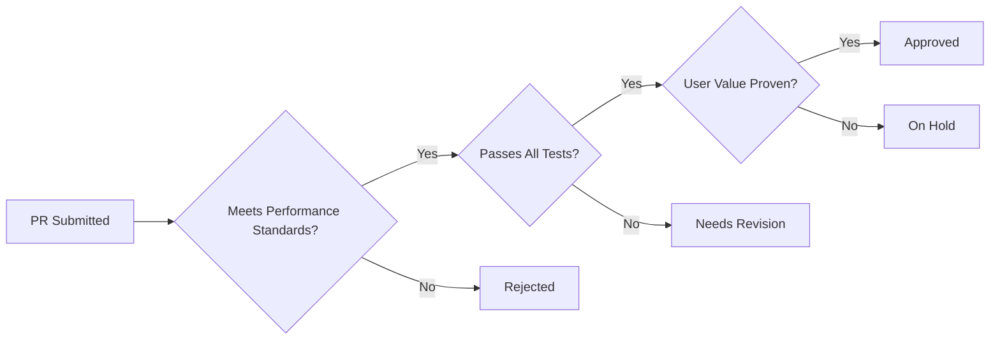

# Contributing to WildMediaServer

## 🛑 Contribution Philosophy
**Performance First** - We prioritize these in order:
1. Critical Bug Fixes
2. Performance Optimization
3. Security Improvements
4. Maintenance & Refactoring
5. New Features (Only if meeting strict criteria)

## 🚫 Feature Policy
New features MUST:
- Solve a **specific** user-reported problem
- Maintain or improve performance metrics
- Include comprehensive testing (unit + integration)
- Provide clear documentation
- Not introduce new dependencies without team approval

## 🔍 Feature Evaluation Criteria
All proposed changes must score ≥4/5 on:

| Criteria            | Description                                  |
|---------------------|----------------------------------------------|
| **Originality**     | Solves unique problem vs. duplicating existing solutions |
| **Usability**       | Immediately valuable to >60% of users        |
| **Friendliness**    | Intuitive UX with zero configuration needed  |
| **Integration**     | Seamless with existing architecture          |
| **Testing**         | 90%+ coverage with real-world scenarios      |

## 🛠 Development Setup
*(Keep previous setup instructions but remove GitHub Discussions reference)*

## 🧑💻 Pull Request Requirements
```diff
+ [ ] Performance impact analysis included
+ [ ] Memory usage comparison (before/after)
+ [ ] Proof of user demand (issues/discussion)
+ [ ] 3-month maintenance commitment
- [ ] No "nice-to-have" features without core team approval
```

## 🏗 Review Process


## 💬 Support
Contact maintainers via:
- Discord: `#technical-discussion`

