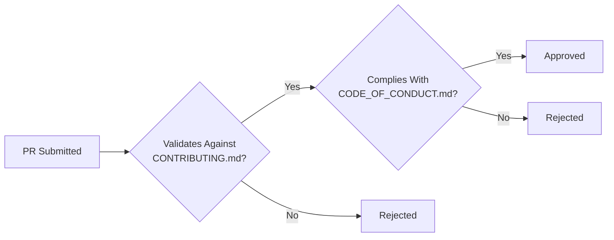

# WildMediaServer 🎬

**Python Media Server** - Vue.js Frontend with MySQL Backend

[](CONTRIBUTING.md)
[](CODE_OF_CONDUCT.md)

## 📜 License
GNU GPLv3 - See [LICENSE](LICENSE) for details.

> **Important Links**  
> 🔗 [Contribution Guidelines](CONTRIBUTING.md)  
> 🔗 [Code of Conduct](CODE_OF_CONDUCT.md)

## 🤝 Contribution Requirements
```python
# Pseudocode validation
if not (pr.meets_performance_metrics and 
        pr.has_approved_issue and
        pr.follows_coc):
    reject()
```

## 🛠 Development Setup
```bash
# Install with policy checks
git clone https://github.com/Vyx-Software/WildMediaServer.git
cd WildMediaServer
./install.sh --verify-policies
```

## ❗ Enforcement Flow

