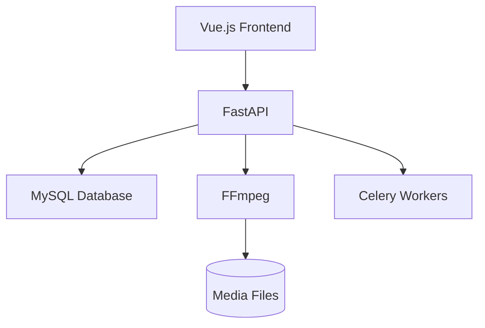

# WildMediaServer 🎬

**Python Media Server** - Vue.js Frontend with MySQL Backend

[](https://python.org)
[](https://vuejs.org)
[](https://mysql.com)

## 🚀 Core Architecture



## 📦 Installation

### Requirements
- Python 3.10+
- MySQL 5.7+
- Node.js 16.x
- FFmpeg 4.3+

```bash
git clone https://github.com/Vyx-Software/WildMediaServer.git
cd WildMediaServer

# Python backend
pip install -r requirements.txt

# Vue frontend
cd frontend
npm install
```

## ⚙️ Configuration

1. Create `.env` file:
```ini
# Database
DB_HOST=localhost
DB_PORT=3306
DB_NAME=wildmedia
DB_USER=media_user
DB_PASSWORD=secure_pass123

# Media
MEDIA_PATH=/path/to/your/media
TRANSCODE_DIR=/tmp/wildmedia_transcodes
```

2. Initialize MySQL:
```sql
CREATE DATABASE wildmedia;
CREATE USER 'media_user'@'localhost' IDENTIFIED BY 'secure_pass123';
GRANT ALL PRIVILEGES ON wildmedia.* TO 'media_user'@'localhost';
```

## 🖥️ Running

```bash
# Start backend
uvicorn app.main:app --host 0.0.0.0 --port 8000

# Start frontend (separate terminal)
cd frontend
npm run serve
```

## 🔧 Database Schema

Key tables:
```sql
CREATE TABLE media (
    id INT AUTO_INCREMENT PRIMARY KEY,
    file_path VARCHAR(255) UNIQUE,
    media_type ENUM('movie', 'tv', 'music'),
    duration INT,
    created_at TIMESTAMP DEFAULT CURRENT_TIMESTAMP
);

CREATE TABLE users (
    id INT AUTO_INCREMENT PRIMARY KEY,
    username VARCHAR(50) UNIQUE,
    password_hash VARCHAR(128),
    last_login DATETIME
);
```

## 🐳 Docker Setup

```docker-compose
version: '3.8'

services:
  db:
    image: mysql:5.7
    environment:
      MYSQL_DATABASE: wildmedia
      MYSQL_USER: media_user
      MYSQL_PASSWORD: secure_pass123
      MYSQL_ROOT_PASSWORD: rootpassword
    volumes:
      - mysql_data:/var/lib/mysql

  backend:
    build: .
    environment:
      - DB_HOST=db
      - DB_PORT=3306
      - DB_NAME=wildmedia
      - DB_USER=media_user
      - DB_PASSWORD=secure_pass123
    ports:
      - "8000:8000"
    depends_on:
      - db

volumes:
  mysql_data:
```

## 📜 Contribution Rules

1. **Performance First**  
   All PRs must include:
   - Memory usage metrics (`/api/debug/memory`)
   - CPU load during stress tests
   - Query execution times for DB operations

2. **Feature Requirements**  
   ```python
   # Example feature validation
   if not (feature.originality_score >= 8 and 
           feature.performance_impact <= 0.5 and
           feature.user_demand >= 50):
       reject_feature()
   ```

3. **Testing Mandatory**  
   ```bash
   # Run validation suite
   pytest tests/ --benchmark-sort=name --benchmark-min-rounds=5
   ```

## 📚 Documentation
- [API Reference](docs/API.md)
- [Admin Guide](docs/ADMIN.md)
- [Performance Metrics](docs/PERFORMANCE.md)
